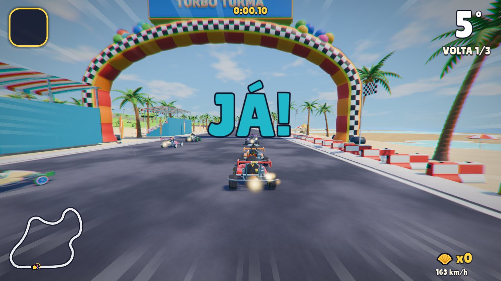
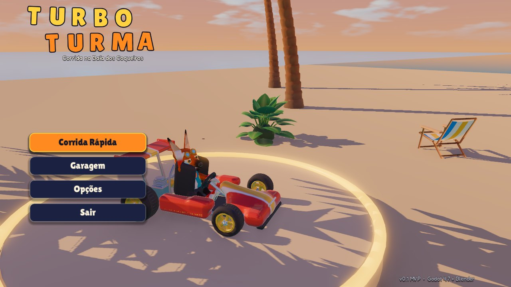
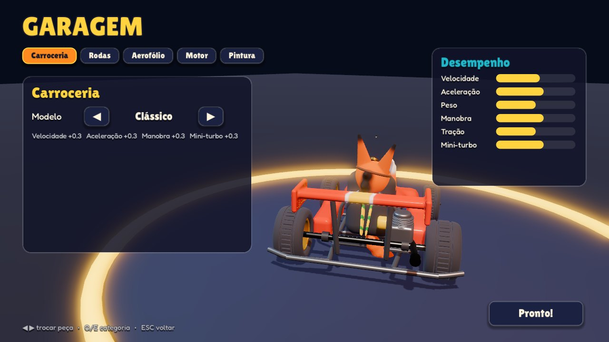
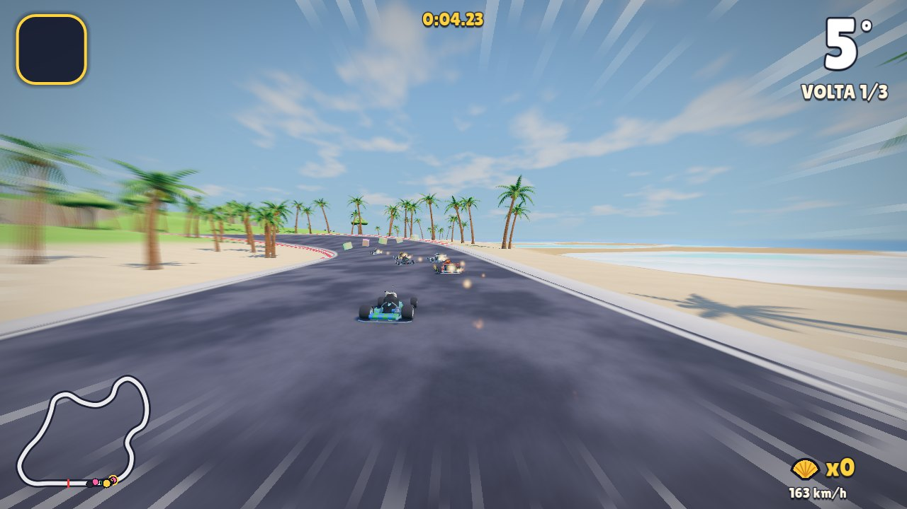
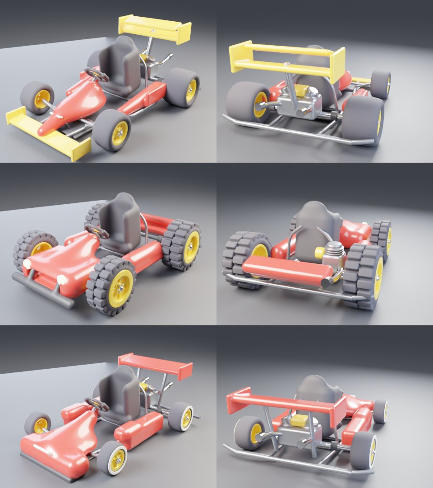
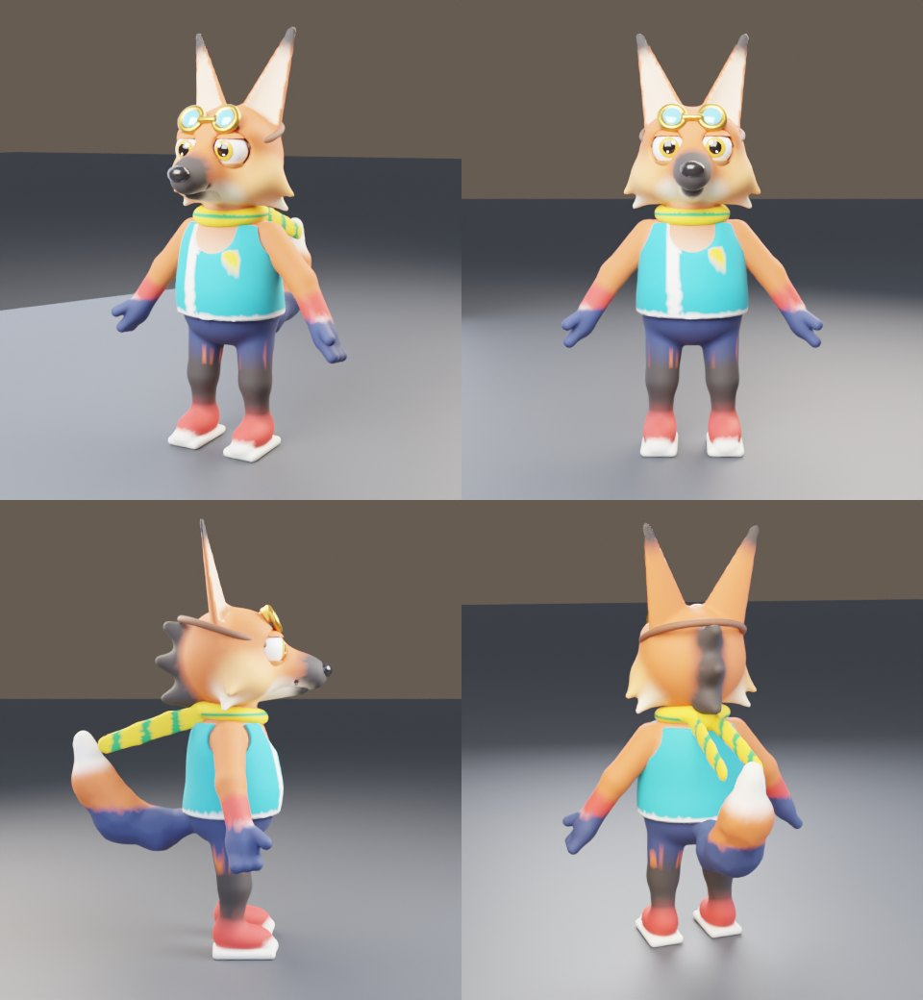
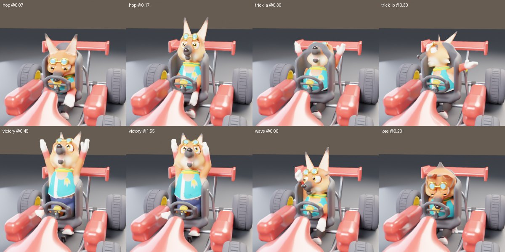
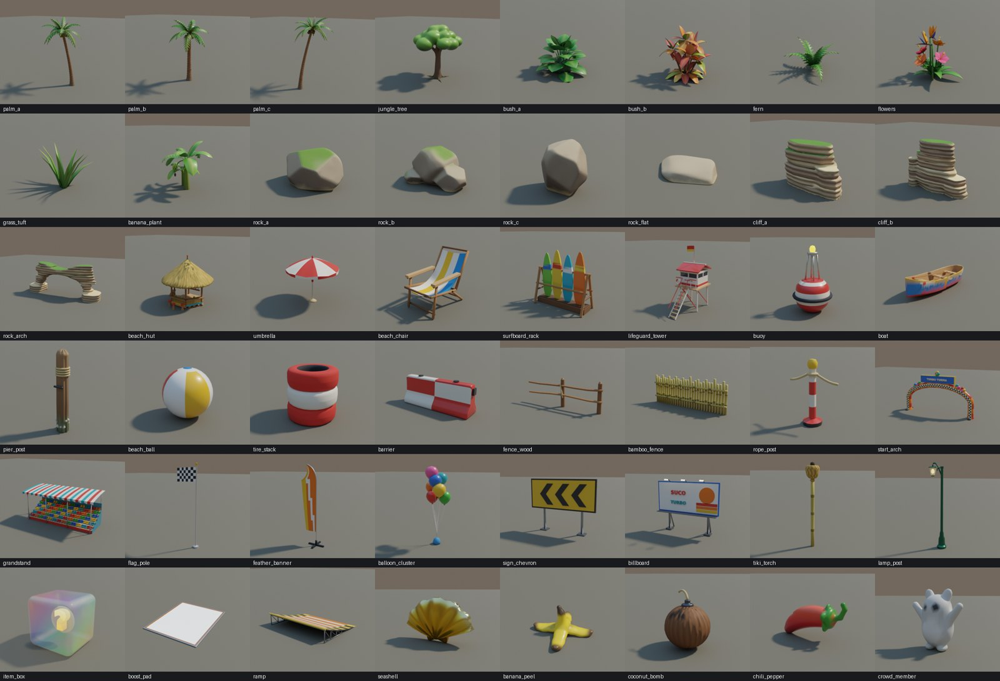

# 🏁 Turbo Turma

Jogo de kart arcade 3D no estilo **Mario Kart / Crash Team Racing**, feito em **Godot 4.7** com todos os
modelos, animações, pista e áudio **gerados por código** (Blender via `bpy` + síntese procedural em Python).

> MVP: uma pista completa (**Baía dos Coqueiros**), um personagem muito animado (**Guará**, o lobo-guará
> piloto), 8 karts na corrida (você + 7 rivais com IA), itens, drift com mini-turbo, garagem de customização.



## Como jogar

1. Instale o **Godot 4.7** (Forward+, GPU com Vulkan).
2. Abra `project.godot` no editor e aperte **F5** (cena inicial: `scenes/main_menu.tscn`).

| Ação | Teclado | Controle |
|---|---|---|
| Acelerar | W / ↑ | A / RT |
| Frear / ré | S / ↓ | B / LT |
| Virar | A D / ← → | Analógico esquerdo / D-pad |
| **Pular / Drift** (segure ao virar) | Espaço / Shift | RB / X |
| Usar item | E / Ctrl | LB |
| Olhar para trás | Q | Y |
| Pausa | Esc / P | Start |

**Dicas de pilotagem**
- **Drift + mini-turbo:** aperte pular numa curva e segure. As faíscas mudam de cor
  (azul → laranja → roxa). Solte para ganhar um turbo mais longo a cada nível. Virar *para dentro* do
  drift fecha a curva e carrega mais rápido; virar *para fora* abre a curva.
- **Largada-foguete:** acelere logo depois do "2" sumir. Cedo demais = motor afoga.
- **Manobra no ar:** aperte pular ao sair de uma rampa → manobra + boost no pouso.
- **Conchas douradas:** cada uma aumenta a velocidade máxima (até 10). Ao ser atingido você perde 3.
- **Itens:** 🌶️ Pimenta (turbo), 🍌 Casca de banana (armadilha para trás), 🥥 Coco-bomba (arremesso
  para frente). Quem está atrás na corrida recebe itens melhores.

## O que tem no MVP

**Jogabilidade**
- Física arcade própria (`scripts/kart/kart.gd`): velocidade/esterço dependentes da velocidade, drift
  controlável com 3 níveis de mini-turbo, hop, boost pads, rampa de salto com janela de manobra,
  largada-foguete, fora-de-pista por superfície (areia/grama), batidas em parede e entre karts com
  peso, spin-out, respawn com animação.
- **IA** com linha de corrida (fora-ápice-fora), controle de velocidade por curvatura, drift só em
  curvas longas, desvio de perigos/karts, uso tático de itens, anti-travamento e *rubber band*.
- Corrida completa: sobrevoo de apresentação, contagem 3-2-1-JÁ!, voltas com checkpoints, posições,
  contramão, volta final (música muda de arranjo), chegada com câmera orbital, câmera lenta, confete e
  tela de resultados.

**Game feel / juice**
- Suspensão com molas, *squash & stretch* do kart (hop, pouso, boost), inclinação nas curvas,
  vibração do motor, câmera com mola no offset, FOV que respira com a velocidade e "chuta" no boost,
  mergulho de câmera no pouso, *screen shake* por trauma, *hit-stop*, vibração do controle.
- VFX procedurais: faíscas de drift por nível + brilho na roda, fumaça/areia/grama por superfície,
  chamas e cone de fogo no escapamento, rastro no boost, estrelas no impacto, explosão, splash, confete,
  caixa de item estilhaçando, linhas de velocidade, blur radial, aberração cromática nos impactos.
- Áudio procedural: motor em 3 camadas (rpm), derrapagem, vento, 50+ efeitos, vozes cartunescas do
  Guará e 6 músicas brasileiras (baião/samba-rock na corrida, bossa nova no menu).

**Personagem — Guará** (`tools/blender/guara.py`, `guara_anim.py`)
- Lobo-guará estilizado modelado por SDF (formas esculpidas), olhos com íris/pupila/brilhos,
  pálpebras, sobrancelhas, mandíbula, crina, cachecol verde-amarelo, óculos de piloto.
- Rig com 44 ossos e pesos automáticos (*bone heat*), **21 animações** autorais usando os
  **12 princípios da Disney** (veja abaixo) + camadas procedurais no Godot: *spring bones* na cauda,
  orelhas e cachecol (follow-through real das curvas e pulos) e cabeça que antecipa as curvas.
- 7 rivais com variações de pelagem/roupa por shader (mesma malha).

**Kart modular e customização** (`tools/blender/kart_parts.py`, `scripts/kart/kart_parts.gd`)
- Slots: **carroceria** (Clássico, Raio, Buggy), **rodas** (Padrão, Slick, Monstro, Rolimã),
  **aerofólio** (Clássica, Dupla, Rabo de Pato), **motor** (Mono, Bicilíndrico) e **pintura**
  (3 cores + 6 padrões: liso, faixa central, faixas duplas, chamas, xadrez, onça).
- Cada peça altera atributos (velocidade, aceleração, peso, manobra, tração, mini-turbo) como no MK8.
- **Garagem** com troca ao vivo (pop com squash & stretch, partículas, som) e barras de desempenho.
- Para adicionar uma peça nova: modele a função no `kart_parts.py`, exporte e registre uma entrada no
  `KartParts.CATALOG` — o resto do jogo (garagem, física, IA) já usa automaticamente.

**Pista — Baía dos Coqueiros** (1,2 km, `tools/blender/track.py`)
- Reta na orla com arco inflável, arquibancadas com torcida animada → curva T1 subindo o promontório →
  chicane → ponte de madeira sobre o rio → hairpin inclinado → túnel no penhasco com tochas → esses na
  selva → boost + **salto sobre o cânion da cachoeira** → curva final inclinada de volta à praia.
- Terreno esculpido, mar com shader de profundidade/espuma, céu com nuvens, 48 props (palmeiras,
  árvores, pedras, quiosques, barcos, boias, barreiras, placas, torcida...), 15 mil tufos de grama
  instanciados.

## Os 12 princípios de animação no Guará

| Princípio | Onde |
|---|---|
| Comprimir e esticar | hop, pouso e boost escalam coluna/peito; o kart inteiro também tem squash & stretch |
| Antecipação | o hop agacha antes de subir; o boost inclina para frente antes do tranco; arremessos fazem "wind-up"; a cabeça vira para a curva antes do kart |
| Encenação | silhuetas claras: vitória em V em pé no kart, olhar para trás com torção |
| Pose a pose | chaves extremas + breakdowns com easing por chave (`tt/anim.py`) |
| Continuidade e sobreposição | cauda, orelhas e cachecol com atraso por elo (baked) + *spring bones* em tempo real |
| Aceleração e desaceleração | easing por chave (`inout`, `out`, `back`, `elastic`) |
| Arcos | trajetórias de mãos/cabeça passam por breakdowns fora da linha reta |
| Ação secundária | piscadas sincronizadas com viradas de cabeça, orelhas tremendo, abanar de cauda, respiração |
| Temporização | estalos de 2–4 quadros contra poses mantidas |
| Exagero | rosto no boost, tontura do spin-out, salto da vitória |
| Desenho sólido | volumes preservados (escala compensa nos outros eixos) |
| Apelo | cabeça grande, olhos expressivos, assimetria (uma orelha atrasa, cabeça inclinada) |

## Galeria

| | |
|---|---|
|  |  |
|  |  |
|  |  |



## Estrutura

```
assets/         modelos .glb, áudio .ogg, fontes (Lilita One, Fredoka — OFL)
data/tracks/    dados de gameplay da pista (linha central, grid, itens, decoração)
scenes/         main_menu, garage, race
scripts/
  autoload/     Game, Audio, Juice, InputSetup
  kart/         Kart (física), KartModel (montagem modular), KartFX, KartAudio, peças/config
  character/    Driver (AnimationTree, spring bones), DriverHeadLook
  race/ ai/ items/ track/ camera/ ui/ fx/
shaders/        pintura do kart, pelagem, estrada, terreno, água, céu, boost pad, caixa de item, telas
tools/
  blender/      pipeline procedural (bpy): tt/ (SDF, core, rig, anim, render), kart_parts, guara,
                guara_anim, track_layout, track, props*
  audio/        síntese procedural de SFX e música (numpy)
  tests/        simulação headless, screenshots, sondas
```

## Regenerar assets

```bash
pip install bpy==5.2.2 numpy scipy scikit-image pillow   # Python 3.13 (Blender 5.2 como módulo)
python tools/blender/build.py karts guara track props     # modelos -> assets/models, data/tracks
python tools/blender/build.py kart_review guara_review     # renders de revisão em tools/blender/out
python tools/audio/build_audio.py                         # áudio -> assets/audio
godot --headless --path . --import                        # reimportar no Godot
```

## Testes

```bash
# corrida completa simulada sem renderização (8 karts com IA, imprime ordem de chegada e voltas)
godot --headless --path . res://tools/tests/sim.tscn -- --t=220 --every=20
# screenshots (precisa de GPU/Vulkan ou xvfb + lavapipe)
godot --path . res://tools/tests/shot.tscn -- --t=6 --shots=3 --out=/tmp/race [--warp=500]
godot --path . res://tools/tests/driver_shot.tscn -- --shots=race:0.8,victory:1.6 --out=/tmp/guara
```

## Próximos passos

Mais pistas e personagens da "turma" (capivara, tucano, onça...), modo Grand Prix, multiplayer em tela
dividida, mais itens, desbloqueio de peças, decalques e buzinas, LODs/otimização para consoles.
